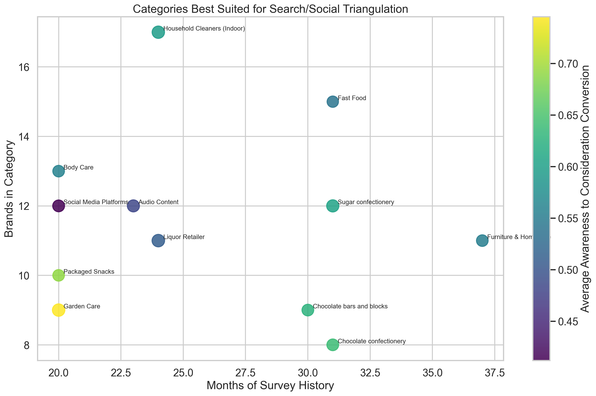
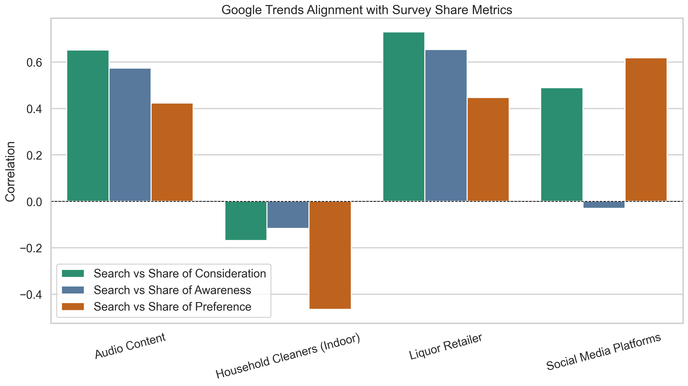
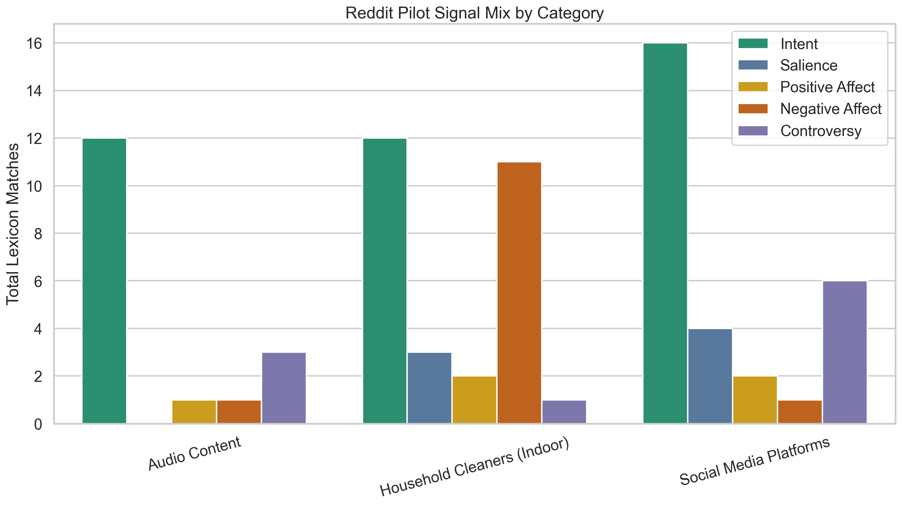

# Tracksuit Brand Science Take-Home

This repository contains my take-home analysis for the Tracksuit Data Scientist (Brand Science) exercise. The core question is whether search-like signals can complement or partially substitute survey-based brand metrics, and where a lightweight text layer can improve interpretation.

Current conclusion: search is useful, but not universally. The strongest answer is a triangulation framework where survey data remains the anchor, Google Trends provides fast directional signal, and text-based lexicons help distinguish intent from noise.

## Repository Structure

- `sample-category-data.csv`: source survey data provided in the take-home
- `src/tracksuit_analysis/`: reusable analysis modules
- `scripts/run_analysis.py`: builds the cleaned panel and core summary tables
- `scripts/fetch_google_trends.py`: collects live Google Trends data via SerpApi
- `scripts/generate_report_assets.py`: creates report-ready charts in `figures/`
- `scripts/score_external_text.py`: scores text rows with the lexicon-based approach
- `scripts/build_notebook.py`: generates a narrative notebook in `notebooks/analysis.ipynb`
- `config/lexicons.yml`: editable lexicon groups for intent, salience, emotion, and controversy
- `data/external/reddit_pilot_template.csv`: starter template for a small Reddit pilot
- `data/external/reddit_collection_plan.csv`: seeded Reddit search plan by category
- `reports/writeup.md`: concise written summary
- `reports/final_analysis.md`: detailed methods, results, interpretation, and recommendation

## Quick Start

1. Install dependencies:

```bash
python3 -m pip install -r requirements.txt
```

2. Run the baseline analysis:

```bash
python3 scripts/run_analysis.py
```

3. Generate figures:

```bash
python3 scripts/generate_report_assets.py
```

4. Optionally collect live Google Trends data:

```bash
export SERPAPI_API_KEY=...
python3 scripts/fetch_google_trends.py
```

5. Build the notebook:

```bash
python3 scripts/build_notebook.py
```

6. Optionally score social or community text:

```bash
python3 scripts/score_external_text.py
```

## Current Direction

The current analysis treats search as a directional behavioral proxy for consideration, not as a universal replacement for survey-based brand tracking. My proposed extension is to triangulate search with a lightweight text layer that captures:

- purchase intent
- brand salience
- positive and negative emotion
- controversy or complaint-driven attention

This is intended to help Tracksuit distinguish healthy demand from noisy attention.

## Current Findings

- Live Google Trends results are strongest in `Liquor Retailer` and `Audio Content`
- `Social Media Platforms` is mixed and likely needs more interpretation support
- `Household Cleaners (Indoor)` is a good example of where search alone appears weak
- The Reddit pilot adds useful interpretation by separating intent-heavy, friction-heavy, and controversy-heavy discussion

For the fuller analysis narrative, see `reports/final_analysis.md`.

## Key Figures

### Category Suitability



### Search vs Survey Alignment



### Reddit Signal Mix



## Notes

- The current repository includes a baseline survey pipeline and a mock social-text example.
- The Reddit pilot is designed as a small qualitative-plus-quantitative extension, not a large-scale social listening product.
- A seeded Reddit query pack is included in `reports/reddit_queries.md`.
- External search or Reddit collection can be added on top of the `data/external/external_signal_template.csv` schema.
- Live Trends category targets are configured in `config/trends_targets.yml`.
- The original task brief remains available in [Instructions.md](./Instructions.md).
