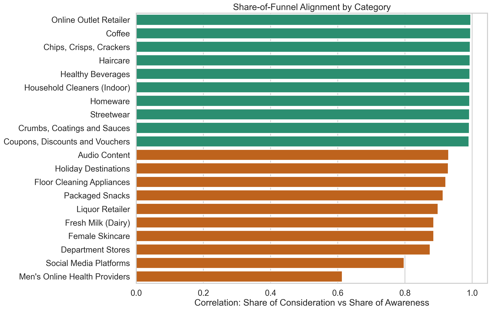
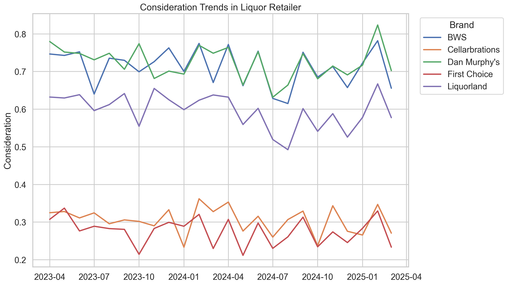
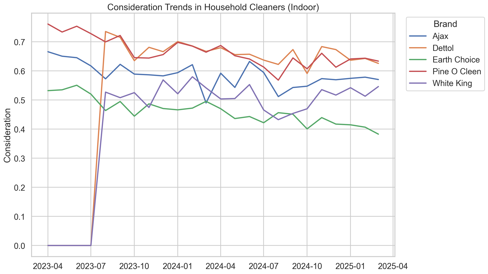

# Final Analysis

## Objective

This analysis explores whether search-based signals can complement or partially substitute Tracksuit's survey-based brand metrics, and whether a lightweight text layer can improve interpretation when search alone is ambiguous.

The central proposition is not that one external signal will replace survey tracking. Instead, the hypothesis is that a triangulated system can be useful:

- survey data remains the calibration anchor
- Google Trends provides a fast directional signal
- text-derived lexicon features explain whether attention reflects demand, salience, friction, or controversy

## Data Sources

### 1. Survey Data

The provided `sample-category-data.csv` contains monthly brand metrics across 50 Australian categories. I transformed this into a brand-month panel with:

- prompted awareness
- consideration
- preference
- awareness-to-consideration conversion
- consideration-to-preference conversion
- within-category share metrics

### 2. Google Trends

I collected live Google Trends data through SerpApi for four shortlisted categories:

- `Liquor Retailer`
- `Household Cleaners (Indoor)`
- `Audio Content`
- `Social Media Platforms`

The Trends data was aggregated to monthly brand-level values and merged to the survey panel on `category_name`, `brand_name`, and `wave_date`.

### 3. Reddit Pilot

I built a small Reddit pilot with `20` raw rows per category for:

- `Household Cleaners (Indoor)`
- `Audio Content`
- `Social Media Platforms`

The purpose of the pilot is not to estimate a statistically representative public-opinion measure. It is to test whether textual signals add explanatory value when interpreting search and survey movement.

## Method

## Survey Baseline

The first step was to identify categories where external signals are most likely to be informative.

I used the survey data to shortlist categories with:

- enough monthly depth
- enough brands
- meaningful variation in consideration
- reasonable awareness-to-consideration conversion structure

This is what produced the shortlist and the triangulation candidate view.

## Google Trends Analysis

For each shortlisted category, I collected brand-level Trends data and compared:

- share of search vs share of consideration
- share of search vs share of awareness
- share of search vs share of preference

The goal was not to prove causality. It was to assess whether search behaves like a useful complement to survey-based consideration in some categories more than others.

## Text / Reddit Analysis

The text layer is lexicon-based for transparency and scalability.

I used five lexicon families:

- `intent`
- `salience`
- `emotion_positive`
- `emotion_negative`
- `controversy`

Methodologically, this is a hybrid approach:

- `emotion_positive` and `emotion_negative` are inspired by NRC-style emotion lexicon work
- `intent`, `salience`, and `controversy` are custom business extensions
- category-specific overrides were added so the same framework could adapt to the language of each vertical

This means the system is explainable and extensible, while still being grounded in established affect-style lexicon thinking.

## Results

## 1. Survey Baseline

The baseline survey pipeline shows that category structure varies substantially. Some categories have clear and stable funnel relationships, while others are noisier or less interpretable from a share-of-funnel perspective alone.

The strongest candidates for triangulation were categories with:

- enough time coverage
- enough competitive depth
- enough dispersion in consideration

This is visualized in:

- `figures/triangulation_shortlist.png`
- `figures/funnel_correlation_overview.png`

## 2. Google Trends Results

The live Trends merge produced a clear category-conditional result:

- `Liquor Retailer` had the strongest relationship between share of search and share of consideration (`~0.73`)
- `Audio Content` also showed a meaningfully positive relationship (`~0.65`)
- `Social Media Platforms` was mixed (`~0.49` with share of consideration, but weak against awareness)
- `Household Cleaners (Indoor)` was weak or negative, suggesting search is not a useful standalone proxy there

Interpretation:

- search works best where brand search intent is explicit and naturally expressed online
- search works less well where brand choice is embedded in practical household behavior rather than brand-led digital discovery

This is the strongest evidence in the project against a universal “Share of Search can replace consideration” claim.

To make the category-conditional result more concrete, I also include two example consideration time series:

- `Liquor Retailer` as a category where the broader triangulation story looks stronger
- `Household Cleaners (Indoor)` as a category where search appears much less useful as a standalone proxy

## 3. Reddit Pilot Results

The Reddit pilot helps explain what search alone cannot.

### Audio Content

This category produced the clearest intent-heavy language:

- switching between Spotify and Audible
- top-up pricing frustration
- listening-hour optimization
- workarounds and value-seeking behavior

This suggests that discussion in this category often reflects active evaluation and usage trade-offs, which is exactly the sort of context that can help explain search movement.

### Household Cleaners (Indoor)

This category produced a very different signal mix:

- smell
- harshness
- chemicals
- safety
- mold removal efficacy

This helps explain why search may be weak here as a proxy for consideration. The category appears to generate practical problem-solving and friction-heavy discussion rather than clean brand-led intent.

### Social Media Platforms

This category produced the richest salience and controversy signal:

- algorithm frustration
- creator reach collapse
- ad load
- privacy concerns
- platform uncertainty

This is especially useful because a spike in attention here may reflect dissatisfaction or policy concern, not healthy brand demand.

The Reddit pilot is visualized in:

- `figures/reddit_signal_summary.png`

## Interpretation

The main takeaway is that triangulation is stronger than substitution.

Search is useful, but uneven. Text is useful, but interpretive. Surveys remain expensive but grounded.

Together, they form a much stronger product story:

- surveys tell you where the brand actually sits
- search tells you when something may be moving
- text tells you what kind of attention is driving that movement

This is especially important because the same increase in search or discussion can mean very different things:

- genuine purchase consideration
- broad salience without action
- frustration or product friction
- controversy or policy-driven attention

## Methodological Validity

This approach is exploratory and should be described that way.

Strengths:

- methodological design was informed by Andreotta et al. (2019, p. 1767), which supports combining computational text analysis with qualitative interpretation in social media research ([link](https://link.springer.com/article/10.3758/s13428-019-01202-8))
- transparent feature engineering
- category-aware rather than generic
- built around a realistic product question

Limitations:

- the Reddit pilot is small and purposive, not representative
- the lexicons are heuristic and not a validated psychological instrument
- correlations do not establish causality
- Trends normalization can complicate cross-category comparisons

## Scalability

This framework is deliberately built to scale:

- survey and Trends data already operate at the brand-month level
- the text layer can accept any source that can be mapped to brand, category, and date
- the lexicon design is modular, so new categories can be added through targeted override dictionaries

In a larger production setting, I would extend this by:

- adding more text sources
- validating the lexicon outputs against human-coded samples
- benchmarking lexicon features against stronger NLP models
- using search and text as interim diagnostics between survey waves

## Future Work: Topic Modelling

I would not make topic modelling a primary method in the current version because the Reddit pilot is still relatively small. With only 20 rows per category, topic discovery would be too unstable to support strong claims.

That said, topic modelling is a strong next-step extension once the text corpus is larger. In a scaled version of this framework, I would use topic modelling to surface recurring themes that are not fully captured by predefined dictionaries, for example:

- pricing and value
- switching and comparison behavior
- algorithm and reach concerns
- safety and product-use friction
- privacy or policy concerns

The best role for topic modelling in this project is therefore as a future discovery layer on top of the current lexicon system:

- lexicons provide transparent, auditable, explainable features
- topic modelling can then identify new recurring themes and inform future lexicon expansion

## Recommendation

My recommendation to Tracksuit would be:

1. Do not position Share of Search as a universal replacement for survey-based consideration.
2. Use search selectively in categories where it empirically aligns with consideration and where branded digital intent is naturally high.
3. Add a lightweight text interpretation layer to classify attention into:
- demand / switching intent
- general salience
- product friction
- controversy
4. Keep survey tracking as the anchor measure and use search plus text as a cheaper and faster complement.
5. At larger text volumes, add topic modelling as a discovery layer to uncover emerging themes that can refine and extend the lexicon framework.
